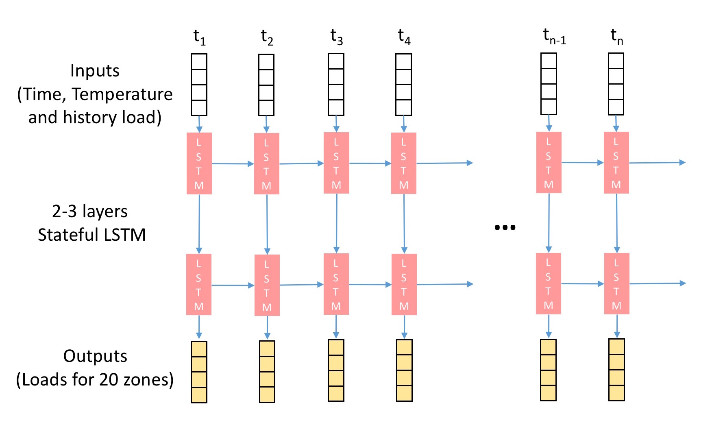

#  Time Series Analysis: Load Forecasting Track of Global Energy
Time series prediction project for IRDM(COMPGI15) 2016 @ UCL

Group 30 (Yijing YANG, Xinyi HE, Ying WEN)


## Models
* Stateful Recurrent Neural Network [Link](./load_prediction_model_stateful_lstm.ipynb) (The detail and result can be found in the ipython notebook)

To more intuitively and vividly illustrate the stateful LSTM model, the following figure shows the structure and processes of the stateful LSTM model: 


* XGBoost

## Results
The results cna be found in ipython notebooks

## Requirements
* Python 2.7
* Keras
* XGBoost

To install all the requirements:

```
pip install requirement.txt
```

## Dataset
* [Load Forecasting](https://www.kaggle.com/c/global-energy-forecasting-competition-2012-load-forecasting/data)
